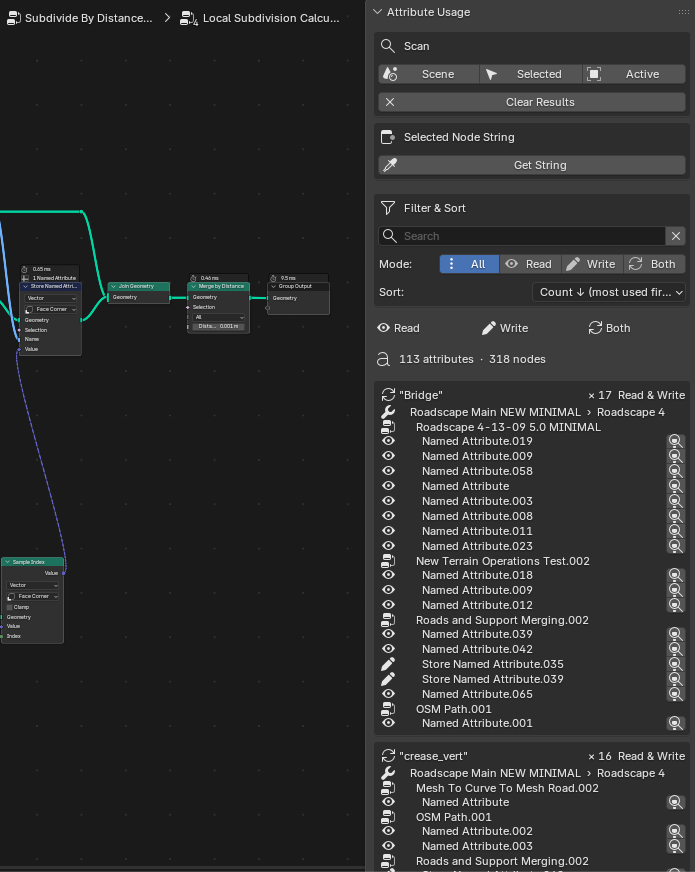

# Geometry Node Attribute Usage (Blender 5.2)

Blender addon that scans Geometry Nodes modifiers to find **named attribute string usage** and analyze how often each attribute is used.

It is designed for large node setups with nested custom groups.

## What It Does

- Scans Geometry Nodes modifiers on:
  - active object
  - selected objects
  - whole scene
- Finds usage from:
  - **Named Attribute** nodes (`READ`)
  - **Store Named Attribute** nodes (`WRITE`)
- Resolves the **actual effective string** even when the name input is:
  - directly typed
  - linked through reroutes
  - linked through nested custom groups (in/out across group boundaries)
- Groups results by:
  - attribute name
  - object / modifier / node tree / node
- Reports whether each attribute is:
  - **Read only**
  - **Write only**
  - **Read & Write**
- Provides sorting and filtering options.

## UI Location

In the Geometry Node Editor sidebar:

- Press `N` in the node editor
- Open tab: **Attr Usage**

## Main Features

### 1) Scan and Analyze

Buttons:
- `Scene`
- `Selected`
- `Active`

Each scan updates the attribute usage list and statistics.

### 2) Filter and Sort

- Search bar with clear `X` button
- Mode filter:
  - All
  - Read
  - Write
  - Both
- Sort options:
  - Count descending (most used first)
  - Count ascending (least used first)
  - Name A-Z
  - Name Z-A
  - Mode grouping

### 3) Focus Result Node

Each found node row has a focus button.

Clicking it:
- navigates to the correct object/modifier context
- enters nested groups automatically
- selects the target node
- frames view on it (`view_selected`)

### 4) Selected Node String Tool

You can manually select a node and click `Get String`:

- resolves the first string input socket value
- follows links and nested groups
- shows resolved socket name and value

Then click:
- `Use This String As Search`

to instantly apply that value to the search filter.

## Installation

1. Download or clone this repository.
2. In Blender: `Edit > Preferences > Add-ons > Install...`
3. Select the addon folder (or zipped addon).
4. Enable **Geometry Node Attribute Usage**.

## Notes

- If a value comes from external group inputs/modifier-driven data and cannot be statically resolved, it may show as unresolved.
- Best results are with explicit string sources in the node graph (typed values, String nodes, linked chains).

## License

MIT. See `LICENSE`.
